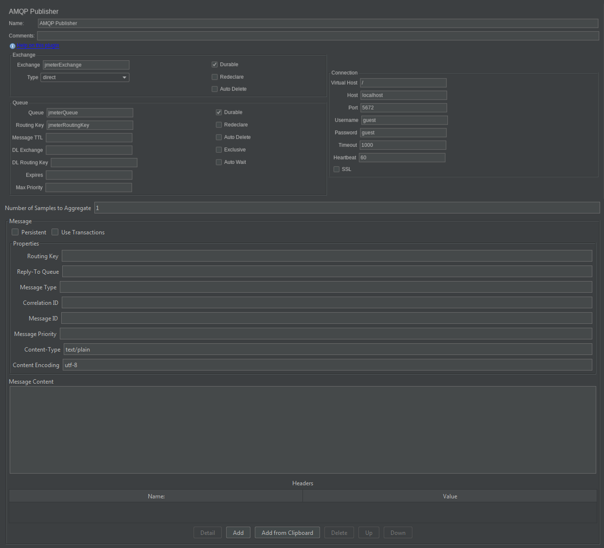
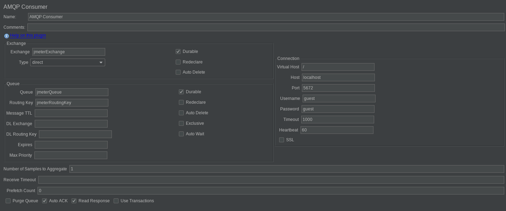

# JMeter AMQP Plugin

[](https://github.com/maurigre/jmeter-amqp-plugin/actions/workflows/maven.yml)
[](https://github.com/maurigre/jmeter-amqp-plugin/releases/latest)

[](CONTRIBUTING.md)

A [JMeter](http://jmeter.apache.org/) plugin to publish & consume messages from [RabbitMQ](http://www.rabbitmq.com/)
or any [AMQP](http://www.amqp.org/) message broker.

## Requirements

  - Requires **JDK 8** or higher.
  - Works with **Apache JMeter 5.6.x**.
  - Compatible with versions up to **5.x.x** of [com.rabbitmq:amqp-client](https://github.com/rabbitmq/rabbitmq-java-client).

## Installation

1. Download the [latest release](https://github.com/maurigre/jmeter-amqp-plugin/releases/latest) or
[build your own](#build) from the source code.
2. Put `jmeter-amqp-plugin-VERSION.jar` into `$JMETER_HOME/lib/ext` directory.\
It contains the necessary AMQP client dependency, no other jars are required.
3. Restart JMeter.

## Usage

This plugin includes 2 samplers:

  - [**AMQP Publisher**](#amqp-publisher)
  - [**AMQP Consumer**](#amqp-consumer)

Both samplers can be found in the **Add -> Sampler** list shown as below:


### AMQP Publisher



### AMQP Consumer



A pre-configured example scenario can be found in the [examples](docs/examples) directory.

## Build

### Build requirements

In order to build JMeter AMQP plugin from source, you will need:

  - [Java 8 or higher](https://www.oracle.com/downloads/)
  - [Apache Maven 3](https://maven.apache.org/)

Build dependencies are managed by Maven.\
Jars should automatically be downloaded by Maven as part of the build process.

In addition, you'll need to copy or symlink the following from `$JMETER_HOME/lib/ext` directory:

  - ApacheJMeter_core.jar

### Build from source

To build, just execute:

```
mvn clean package
```

This will create 2 jars in `/target` directory - the jar with all the dependencies within
(this is the one you need) and the original jar (without amqp-client library inside):

```
target/jmeter-amqp-plugin-VERSION.jar
target/original-jmeter-amqp-plugin-VERSION.jar
```

### Install

To install, execute:

```
cp target/jmeter-amqp-plugin-VERSION.jar $JMETER_HOME/lib/ext
```

Restart JMeter.

## Acknowledgements

Thanks to
  - [aliesbelik](https://github.com/aliesbelik) (Aliaksandr Belik), who created [adapted plugin](https://github.com/aliesbelik/jmeter-amqp-plugin);
  - [jlavallee](https://github.com/jlavallee) (Jeff Lavallee), who created [original plugin](https://github.com/jlavallee/JMeter-Rabbit-AMQP);
  - [polarnik](https://github.com/polarnik) (Viacheslav Smirnov), who spent time and efforts to create
[comparison](https://github.com/polarnik/JMeter-Rabbit-AMQP-info) of the forks with valuable changes;
  - for the features & enhancements implemented in their forks:
    - [gregLibert](https://github.com/gregLibert/JMeter-Rabbit-AMQP) (Gregory Libert),
    - [gybandi](https://github.com/gybandi/JMeter-Rabbit-AMQP) (Gyuro Andras),
    - [looseend](https://github.com/looseend/JMeter-Rabbit-AMQP) (John Singleton),
    - [sergiogouveia](https://github.com/sergiogouveia/JMeter-Rabbit-AMQP) (Sergio Gouveia),
    - [wojtek-oledzki](https://github.com/voytek-solutions/JMeter-Rabbit-AMQP) (Wojtek Oledzki),
    - [zeph1rus](https://github.com/zeph1rus/JMeter-Rabbit-AMQP);
  - all the [contributors](https://github.com/jlavallee/JMeter-Rabbit-AMQP/graphs/contributors) to original project.

## Contributing

Contributions are welcome.\
Please take a look at the [contributing](CONTRIBUTING.md) guideline first.
